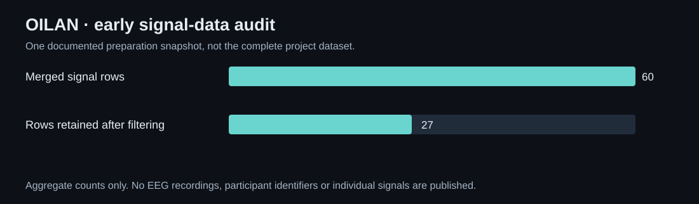

# OILAN
### Investigating an interface between intention and assistive movement.

A team project exploring a single-channel EEG brain–computer interface for assistive wheelchair control. The work includes participant data collection, signal preparation, markers, calibration, model experiments and a separate interactive product presentation.

**Experimental prototype · Samsung Solve for Tomorrow 2026.**

## Begin with the signal you actually have

The documented hardware path uses a **NeuroSky MindWave single-channel sensor**, with a dry frontal electrode. Its records include attention/meditation indicators, contact quality and band-power measurements. Before asking a model to infer a command, the pipeline needs to distinguish usable observations from poor contact, repeated values and missing indicators.

An early preparation snapshot combined five files, removed one exact duplicate and retained 27 of 60 merged rows after filtering. This is one inspected data audit, not the size of the entire team’s later work.

*Aggregate counts from the early signal-preparation report. The raw participant recordings remain private.*

## Signal preparation before command prediction

The analysis workflow checks duplicates, value ranges, signal quality and frozen measurements. Feature preparation includes relative band powers, ratios and short-window statistics such as means, variation and deltas. The inspected snapshot produced 48 engineered features.

Exploratory clustering and dimensionality reduction can reveal structure in those features. That structure does not automatically represent “left,” “right,” “forward” or “stop.” A cluster of signal states is not a labelled command, and correlations with the headset’s own indicators are not a demonstration of safe wheelchair control.

~~~mermaid
flowchart LR
 A[EEG sessions and event markers] --> B[Quality audit]
 B --> C[Clean windows and features]
 C --> D[Calibration and model experiments]
 D --> E[Offline evaluation]
 E -. future validated integration .-> F[Assistive control interface]
~~~

## Labels and evaluation define the next experiment

The early snapshot lacked directional targets, limiting what could be learned from it. A useful collection protocol needs time-aligned prompts or events, labels, repeated trials and multiple sessions. Splitting by session matters: adjacent samples from one recording should not make a model appear to generalize to a new person or day.

The broader team work includes recording and marker preparation, calibration, training and testing. This showcase separates that project scope from the narrower early audit for which concrete counts are available. It does not assign an unsupported control-accuracy number to the full system.

## A separate visual communication project

The OILAN website presents the assistive-mobility idea through an interactive 3D wheelchair and EEG concept, a neural particle field, procedural ASCII imagery and a technical visual language. It was implemented with **React, TypeScript, Vite, Three.js and React Three Fiber**, with motion and accessibility fallbacks.

That website is a concept presentation. Its early promotional copy contains illustrative pilot figures and a multi-channel product vision that do not describe the documented single-channel experiment. Those figures are not repeated here as measured achievements.

| Workstream | Completed material | Evidence boundary |
|---|---|---|
| Signal work | Collection, markers, preparation and feature experiments | Participant data stays private |
| ML investigation | Calibration, training/test work and an early data audit | No generalizable command accuracy claimed |
| Product communication | Interactive 3D and ASCII-based website | Concept visuals are distinct from hardware validation |
| Assistive integration | Wheelchair-control research direction | Clinical and autonomous-operation effectiveness not established |

## The engineering lesson

The scarce resource was reliable, interpretable data rather than model complexity. Poor contact, repeated measurements, missing labels and session leakage can invalidate a promising-looking experiment. OILAN’s meaningful story is the process of turning a compelling assistive idea into a testable signal pipeline while keeping the intended product separate from what has actually been measured.

---

### Built by

**OILAN team**, including [Shakhnazar Akhmer](https://github.com/Eye172).

[More projects](https://github.com/Eye172) · [Contact](mailto:shakh090909@gmail.com)

This repository presents the product and its engineering. Implementation and internal data are maintained separately. Screenshots and documented experiments are identified in their captions.
